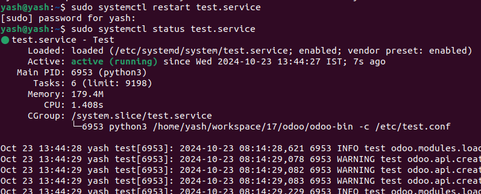
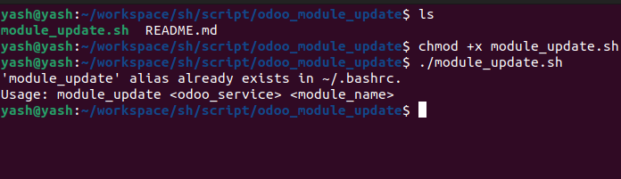
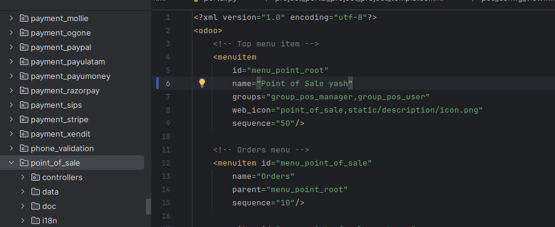
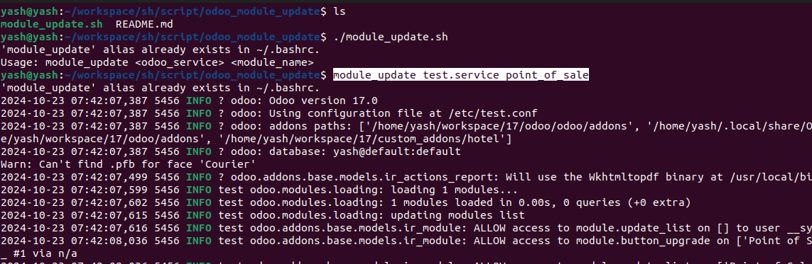
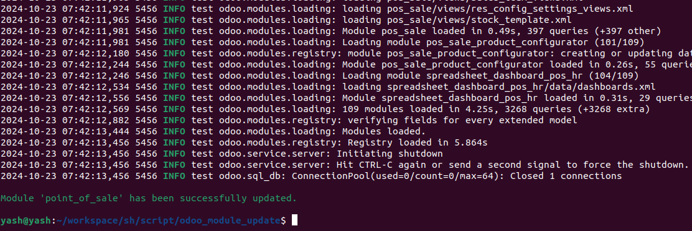
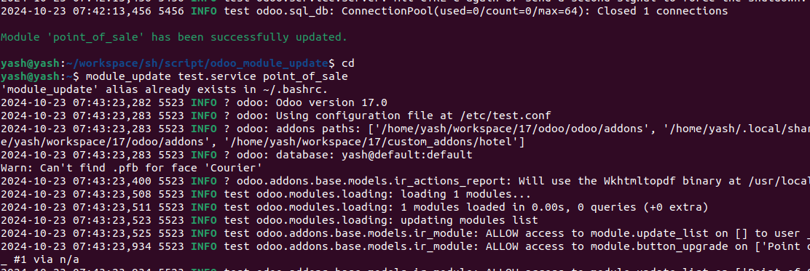
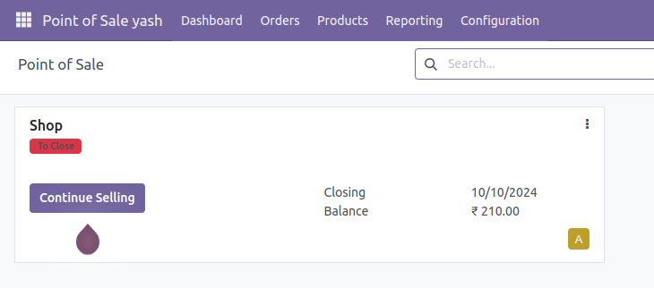

  

# Odoo module update

**module_update.sh** script is designed to automate the process of updating Odoo modules efficiently. This script simplifies the management of Odoo modules by allowing users to quickly apply updates without manual intervention.

# Ensure the Odoo service is running by executing

  

## Run sh file method

If you want everything about reverse proxy phishing with **Evilginx** - check out my [Evilginx Mastery](https://academy.breakdev.org/evilginx-mastery) course!

  

## Run sh file method

  

## Run sh file method

  

## Run sh file method

  

## Run sh file method

  

## Run sh file method

  

Learn everything about the latest methods of phishing, using reverse proxying to bypass Multi-Factor Authentication. Learn to think like an attacker, during your red team engagements, and become the master of phishing with Evilginx.

Grab it here:
https://academy.breakdev.org/evilginx-mastery

## Help

In case you want to learn how to install and use **module_update.sh**, please contact me in linkedin:

https://www.linkedin.com/in/yashvanthkumar-d-3414b3229/
